# Acsyra

**Acsyra - Employee Account Management Console** is a C++ console application for managing employee accounts with role-based access for administrators and staff. It features secure login, account management, and file-based data storage. The source code follows a layered architecture in logical structure, not physical project separation. [See more here](PROJECT_CONTENT.md)

# Table of Contents
* [Getting Started](#getting-started)
* [Contributing](#contributing)
* [Screenshots](#screenshots)
* [License](#license)

## Getting Started

1. Clone the Repository
2. Open in Visual Studio

    * Open [`acsyra.sln`](acsyra.sln) with Visual Studio 2022 or newer
    * Switch to **Folder View / File Explorer View** (recommend)

3. Build and Run

    * Set `acsyra.vcxproj` file or `acsyra` project as the startup project
    * Press `F5` to run the application

## Contributing

* Use **clang-format version 21.1.x or higher**; pre-commit hooks will enforce formatting.
* When opening the project in Visual Studio, please switch to **Folder View / File Explorer View** instead of Solution View. The `.vcxproj.filters` file is not committed to the repository, so the default Solution View layout will not represent the actual project structure.

## Screenshots

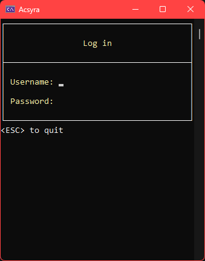
*Figure 1: Login screen*

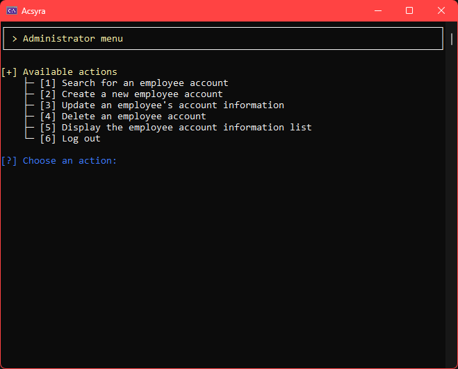
*Figure 2: Administrator screen*

    
More

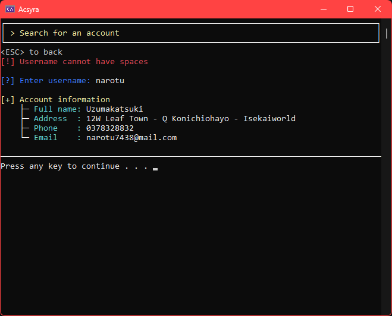
*Figure 3: Administrator account search screen*

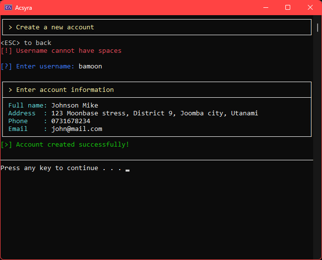
*Figure 4: Administrator account creation screen*

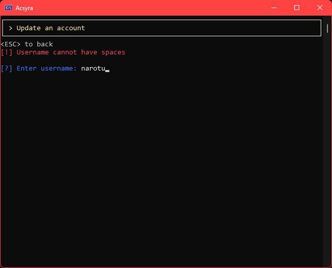
*Figure 5: Administrator account information update screen 1*

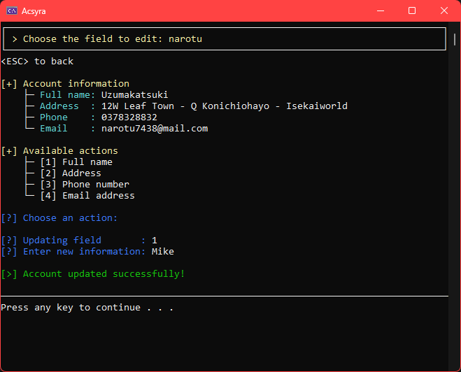
*Figure 6: Administrator account information update screen 2*

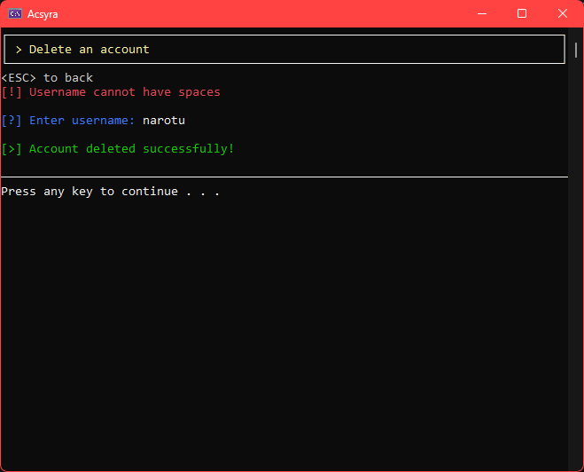
*Figure 7: Administrator account deletion screen*

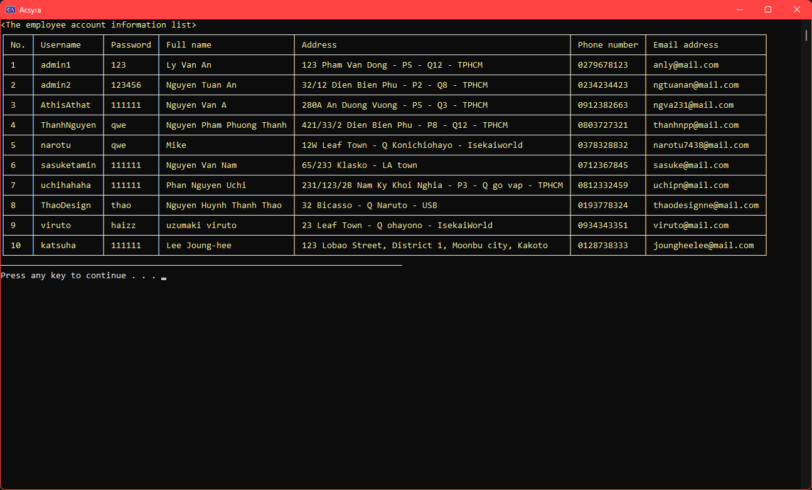
*Figure 8: Screen to view all accounts*

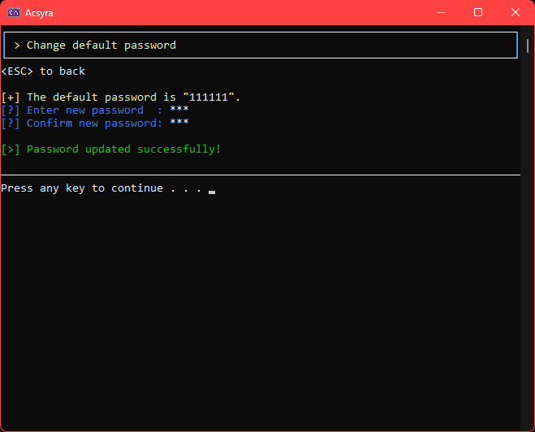
*Figure 9: Default password change screen*

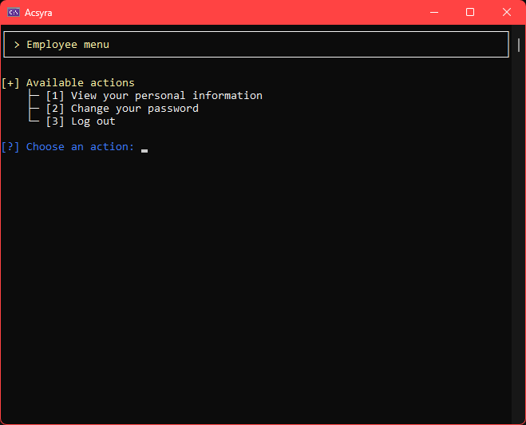
*Figure 10: Employee screen*

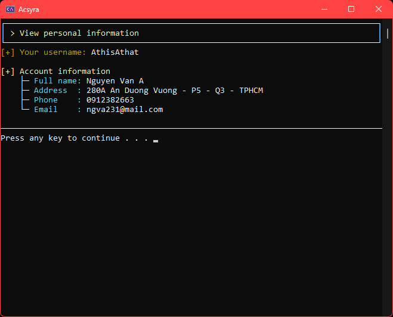
*Figure 11: Employee personal information screen*

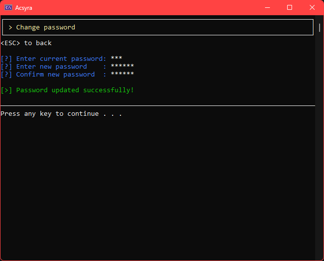
*Figure 12: Employee password change screen*

## License

<!-- This project is open source and available under the MIT License. -->
*Not available*
